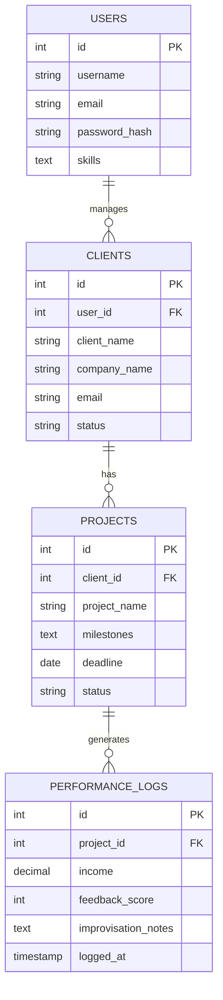

## 🚀 Intelligent Improvisation for Digital Entrepreneurs

### Freelancer Project Management Web Dashboard🚀 

* As digital entrepreneurship and freelance workflows evolve, managing clients, project milestones, and performance metrics efficiently is more critical than ever.

* To streamline this, I built a production-grade Freelancer Project Management Web Dashboard designed for internship submission and enterprise deployment, leveraging Python, Streamlit, and MySQL.

Here is a breakdown of the core architectural and security decisions implemented:

*  **🧠 Relational Database Architecture (MySQL):** Designed a robust One-to-Many schema linking Users $\rightarrow$ Clients $\rightarrow$ Projects $\rightarrow$ Performance Analytics logs for complete operational visibility.

*  **🔒 Enterprise Security Guardrails:** Implemented parameterized queries for robust SQL injection protection, SHA-256 cryptographic password hashing, and session-based route authentication.

*  **⚡ Streamlined Workflow Execution:** Interactive modules for real-time client management, dynamic milestone setting, and deadline tracking.

*  **🧪 Environment Isolation:** Secure credential management via python-dotenv (.env) to ensure local and production safety.

### 🏛️ System & Database Architecture
---
The application follows a clean modular layout backed by a relational MySQL structure. Below is the Entity-Relationship (ER) architecture diagram:


### 🛠️ Challenges & Solutions During Development
---
**Challenge:** Managing local MySQL authentication setups and configurations across different developer environments without hardcoding credentials.

**Solution:** Integrated XAMPP/phpMyAdmin compatibility with seamless .env abstraction (python-dotenv) and bulletproof connection error-handling.

**Challenge:** Ensuring security against malicious input payload injections (SQL Injection).

**Solution:** Eliminated raw string concatenation in favor of strict parameterized queries (cursor.execute(query, params)) across all database operations.

**Challenge:** Protecting unauthorized access to administrative and project execution dashboards.

**Solution:** Implemented robust session-based state checks (st.session_state) ensuring session validation prior to rendering core modules.

### ⚙️ Local Setup & Execution Guide
---
1.Clone or Open the Project Directory in VS Code.

2.Start XAMPP Control Panel and ensure the MySQL and Apache services are running.

3.Configure the Database:
  * Open http://localhost/phpmyadmin in your browser.
  * Create a new database named freelancing_db.
  * Import or run the database/schema.sql script to establish all relational tables.

4.Configure Environment Variables:
* Create a .env file in your root directory:DB_HOST=localhost
```
DB_USER=root
DB_PASSWORD=
DB_NAME=freelancing_db
```
5.Install Dependencies and Run the App:
```
pip install -r requirements.txt
streamlit run app.py
```

Check out the full source code and database schema design for your submission!
```
🔗 GitHub Repo: https://github.com/your-username/freelancer-project-management
```

I'd love to hear your thoughts or feedback on building secure Python & Streamlit web architectures! 👇

#Python #Streamlit #MySQL #SoftwareEngineering #WebDevelopment #FreelancerManagement #DatabaseDesign #DatabaseArchitecture